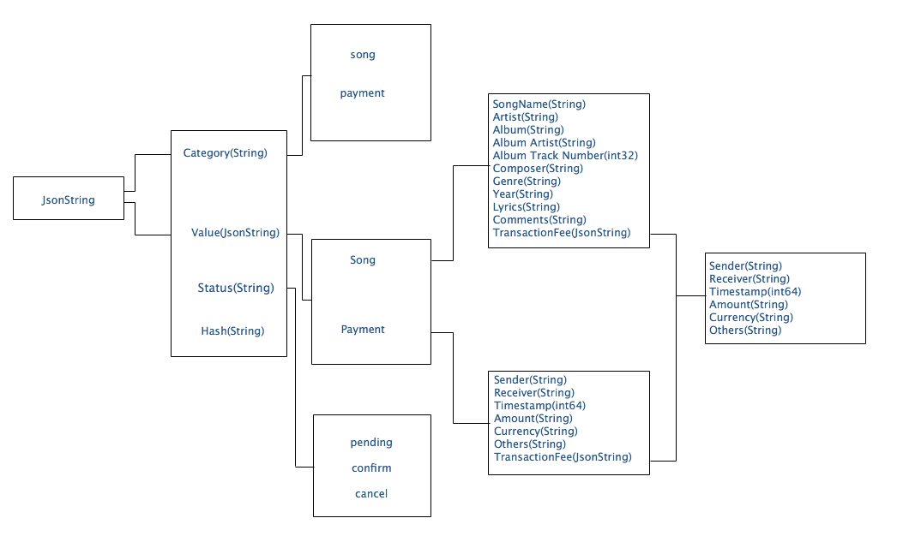

## Application Name
Songs/Singers Management

## Brief Description
Usually, if a person wants to post a song or become a singer, he/she needs to sign a record company. 
With the development of blockchain technology, everyone can post your own song and become the singer without signing a record company. 
Your songs will be recorded in the blockchain network. The copyright of the song will be only own by the singer himself/herself 
instead of the record company, which is called distributing Copyrights.

## What:
Decentralized record company

## Why:
Most of the time, the copyright of the song is controlled by the record company. Also, some people lie about the sources of the songs 
and may plagiarize someone else’s ideas. With the blockchain technology, people put everything about the song into the blockchain, 
which is immutable. And since the blockchain is public, everyone in the blockchain can see the songs’ information and people can prove 
the copyright of the songs by its owner.

## How:
Singers post their songs in the blockchain. People pay for tokens to listen to music. Since music is a pure fan-driven industry, 
singers also can spend tokens letting fans advertise the songs to more people, for example, fan A may have 10 followers or 10 people 
in the peersList, fan B may have 1,000 followers or 1,000 people in the peersList, fan B should get more tokens from the singers in 
helping to advertise the songs since fan B is more influential. Or the singer can give the token holders 20 percent of the song's future earnings. 
In this way, we use the feature of token to reflect these originally soft values, since the token can be divided into very very small pieces. 
Furthermore, fans can raise money to let their idols post new songs. 

## Functionalities/Success
- Singer can post the songs’ information
- Singer can spend tokens letting the fans/users advertise the songs
- Singer receives tokens when people listen to the singer’s music
- User spend tokens when listen to the singer’s songs
- User can spend tokens raising tokens to let their idols post new songs
- User can earn tokens by adverting the singer’s songs
- User can earn tokens if the singer decides to give the token holders some percent of the songs future earnings as long as the user advertises the songs
- Miners can earn transaction fees

## Midpoint milestone
| Milestones        | Expected Completion Date | Actual Completion Date     |
| :---              |    :----:                |          :---: |
| Design structures, includes components of the application,  what should be store in the songs’ info,  communication protocols between users,  algorithm of posting to blockchain| Apr 24       | Apr 25   |
| Singer posts the songs’ information   | Apr 27        | Apr 27     |
| Singer receives tokens when people listen to the music| Apr 28 | Apr 30|
| Users spend token listening to music| Apr 29 |      |
| Miners earn transaction fees| Apr 30 | |
| Singer spends tokens letting users advertise the song| May 5 ||
| Users receive tokens when advertising the songs| May 5 ||
| Singer spends tokens when deciding to give the songs’ future profit to fans| May 8 ||
| Singer receives tokens when fans raise tokens and want their idols to make new nice songs| May 12 ||
| Final report and prepare project demo| May 14 ||

## Design
- ### Data structure
   
   - For the mpt, which stores key-value pair structure, the key would be [userID]+id+[timeStamp], the value structure would be:
   
   
## References
[1] Inspiration from Xiaosong Gao, who is the Chairmen of Alibaba Music Group and the Chairman of Alibaba Entertainment Strategic Committee.

[2] Song Metadata Standards "https://www.synchtank.com/blog/the-guild-of-music-supervisors-suggested-metadata-standards/"

[3] Inside an Ethereum transaction "https://medium.com/@codetractio/inside-an-ethereum-transaction-fa94ffca912f"

